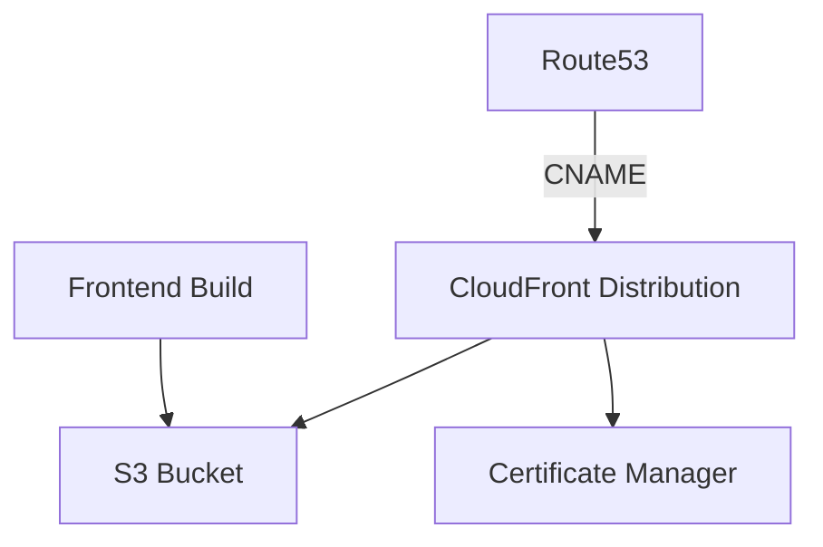

# Frontend Deployment Guide

## Overview

This document describes the frontend deployment architecture and processes for updating and maintaining the application across different environments.

## Architecture

### Core Components

- **AWS CloudFront**: CDN distribution for content delivery
- **S3 Bucket**: Static file storage
- **AWS Certificate Manager**: SSL certificate management
- **Route53**: DNS management (when using custom domain)

### Stack Structure



## Environment Configuration

### File Structure
```
.
├── .env.dev
├── .env.demo
├── .env.prod
└── lib/
    ├── config.ts         # Domain configuration
    └── chat-frontend-stack.ts  # Infrastructure stack
```

### Required Environment Variables

```bash
AWS_ACCOUNT_ID=            # AWS account ID
AWS_REGION=               # AWS region (e.g., us-east-1)
AWS_ACCESS_KEY_ID=        # Access Key ID
AWS_SECRET_ACCESS_KEY=    # Secret Access Key
CERTIFICATE_ARN=          # SSL certificate ARN
USE_CUSTOM_DOMAIN=        # true/false - Enable/disable custom domain
```

## Deployment Process

### 1. Frontend Build

```bash
# Install dependencies
npm install

# Build frontend for specific environment
npm run build:dev    # For development
npm run build:demo   # For demo
npm run build:prod   # For production
```

### 2. Initial Deployment

For first deployment in an environment:

```bash
# Deploy with custom domain
make deploy ENV=<dev|demo|prod>
```

### 3. Subsequent Updates

For updates that only modify the frontend:

```bash
# Build and deploy without modifying the distribution
make deploy-no-domain ENV=<dev|demo|prod>
```

## Domain Management

### Domain Configuration

Domains are configured in `lib/config.ts`:

```typescript
export const config: Config = {
  dev: {
    environment: 'dev',
    domainName: 'chat.dev.aubilities.com',
    certificateArn: process.env.CERTIFICATE_ARN ?? ''
  },
  // ... other environments
};
```

### DNS Conflict Resolution

If there are DNS conflicts with existing domains:

1. Use `make deploy-no-domain ENV=<environment>`
2. Application will use CloudFront domain by default
3. Outputs will show the correct URL to use

## Deployment Outputs

After deployment, you'll see:

- **DistributionDomainName**: CloudFront domain (always available)
- **CustomDomainName**: Custom domain (if configured)
- **WebsiteURL**: Main URL for accessing the application

## Validations and Security

### Automatic Validations

- `CERTIFICATE_ARN` verification
- Domain configuration validation
- Required environment variables check

### Security Policies

- S3 public access blocked
- Forced HTTPS redirection
- S3 origin access control via OAC

## Troubleshooting

### DNS Conflicts
```bash
# Error: Invalid request provided: AWS::CloudFront::Distribution
make deploy-no-domain ENV=<environment>
```

### SSL Certificates
```bash
# Verify certificate ARN
echo $CERTIFICATE_ARN

# Update certificate
export CERTIFICATE_ARN=<new-arn>
```

## Rollback

To revert changes:

1. Identify last successful deployment
2. Use `make deploy-no-domain ENV=<environment>` with previous version
3. Verify functionality at provided URL

## Best Practices

1. **Always build** before deploying
2. Use `deploy-no-domain` for frontend updates
3. Verify outputs after deployment
4. Keep backups of `.env.<environment>`

## Estimated Operation Times

- Initial build: ~2-3 minutes
- Initial deployment: ~5-7 minutes
- Frontend update: ~3-4 minutes
- Rollback: ~3-4 minutes

## Monitoring

- CloudWatch for CloudFront logs
- S3 for access logs
- CloudFormation for stack state

## References

- [AWS CloudFront Documentation](https://docs.aws.amazon.com/AmazonCloudFront/latest/DeveloperGuide/Introduction.html)
- [AWS CDK Documentation](https://docs.aws.amazon.com/cdk/latest/guide/home.html)
- [Route53 DNS Management](https://docs.aws.amazon.com/Route53/latest/DeveloperGuide/Welcome.html)